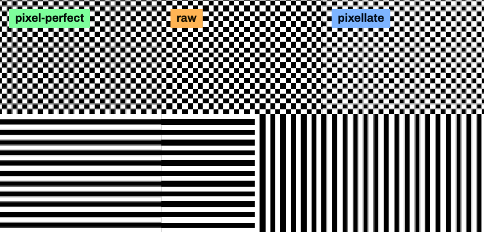
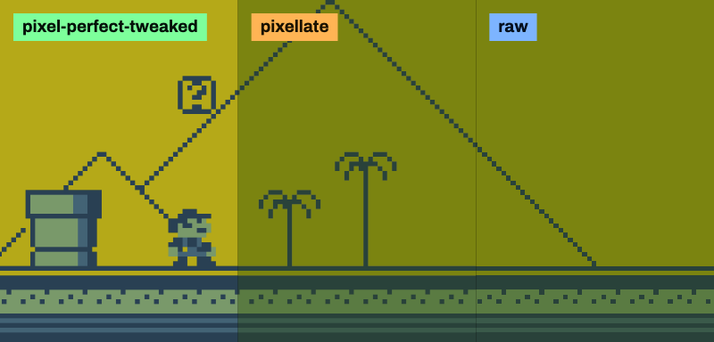
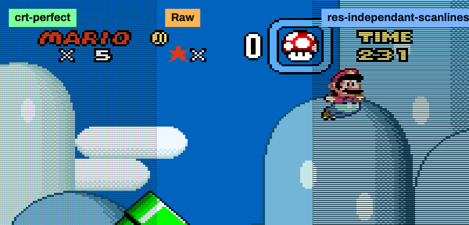
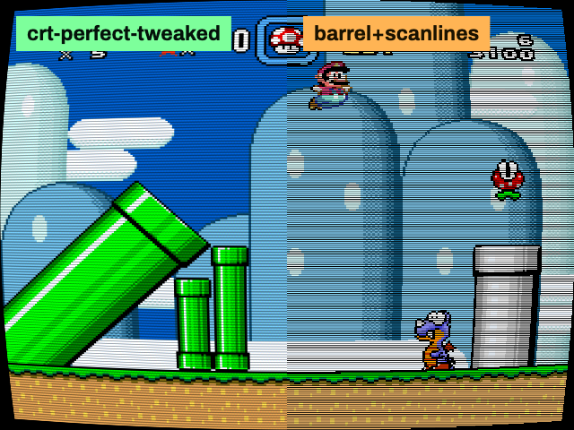
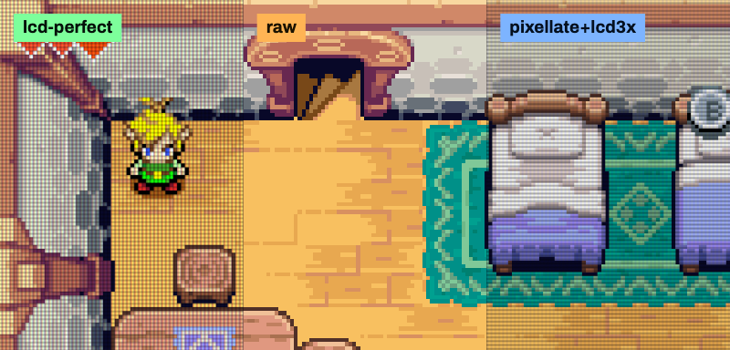
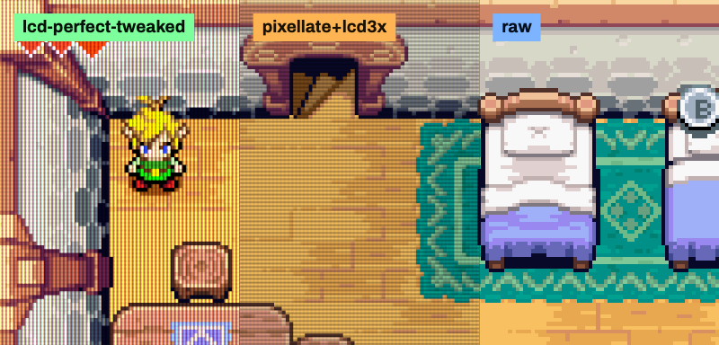
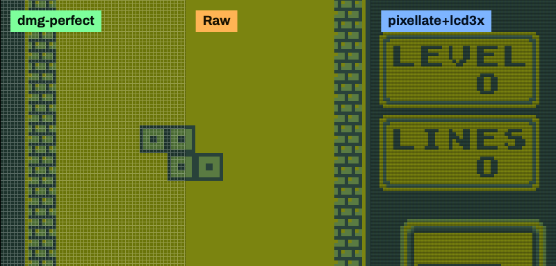
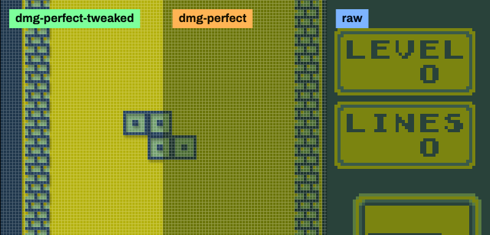

# 📺 perfect-retroshaders

**My take on the "perfect" retro shaders: a retro look without compromising
performance and brightness.**

## Perfect retroshaders, really?

I'm sure everyone has their own idea of what a "perfect" retro shader is, but for me, it has to meet a few criteria:

- Good enough to give a **nice retro look without compromising performance**. It runs fast on cheap handheld devices (Trimui Brick, H700, etc).
- **Limit brightness loss, avoid moire patterns, and other artifacts** that can be annoying at non-integer scaling factors.
- **Good defaults but tweakable** to appeal both non-technical users and shader enthusiasts alike. They're optimized for single-pass pipelines and handle pixel perfect upscaling, no need for complex setups.

All shaders provided here follow these principles, and were tested on a real device to ensure they meet the performance and visual quality goals. I even built a [custom lab](https://sinedied.github.io/retroshader-lab/) to experiment and pixel-peep them against many popular alternatives.

## Shaders

| Shader                                             | Description                                                                                                   |
| -------------------------------------------------- | ------------------------------------------------------------------------------------------------------------- |
| [`pixel-perfect.glsl`](shaders/pixel-perfect.glsl) | **Sharp pixel upscaling.** Uniform pixel blocks, no shimmer, colour controls                                  |
| [`crt-perfect.glsl`](shaders/crt-perfect.glsl)     | **CRT.** Scanlines, RGB mask, optional screen curvature, pixel-perfect scaling                                |
| [`lcd-perfect.glsl`](shaders/lcd-perfect.glsl)     | **LCD.** Black-matrix grid, RGB subpixel stripes, pixel-perfect scaling                                       |
| [`dmg-perfect.glsl`](shaders/dmg-perfect.glsl)     | **Game Boy DMG.** Dot-matrix grid with light gaps, optional cast shadow, white balance, pixel-perfect scaling |

> [!IMPORTANT]
> **These shaders need a `LINEAR` filter, in addition to rendering at the screen resolution.**
> They scale from a single filtered tap, so with `NEAREST` the pattern still draws and nothing *looks* broken, while the picture underneath it is plain nearest-neighbour.

These shaders are designed to output at the final display resolution, as the upscaling is done internally. They are made to work at non-integer scaling factors with almost no visible artifacts/patterns, though the image will still look better at integer scales.

### Composable versions

The same looks with **no scaler of their own**, so you can pick your own or stack them. Each one draws its pattern over whatever it is given, at 1:1, which makes them cheaper than the shaders above and lets you combine effects.

| Shader                                             | Description                                                                     |
| -------------------------------------------------- | --------------------------------------------------------------------------------- |
| [`crt-mini.glsl`](shaders/crt-mini.glsl)           | **CRT pattern.** Scanlines and RGB mask, no scaling, no curvature               |
| [`lcd-mini.glsl`](shaders/lcd-mini.glsl)           | **LCD pattern.** Grid and RGB subpixel stripes, no scaling                      |
| [`dmg-mini.glsl`](shaders/dmg-mini.glsl)           | **Game Boy pattern.** Dot-matrix grid and optional cast shadow, no scaling      |
| [`colour-mini.glsl`](shaders/colour-mini.glsl)     | **Colour only.** White balance, brightness, contrast, saturation, gamma         |
| [`unflat-mini.glsl`](shaders/unflat-mini.glsl)     | **Screen curvature.** Barrel distortion with rounded corners, nothing else      |

Put a scaler in front of them like `pixel-perfect` or use them on their own and let the sampler do the upscale.

> [!IMPORTANT]
> dmg-mini and unflat-mini **need a `LINEAR` filter for their rendering to work as designed.**

> [!NOTE]
> Composing costs a little quality against the single-pass shaders: `unflat-mini` bends a picture whose pattern has already been drawn, so the pattern is resampled and softens by about 6% against `crt-perfect` doing both at once. Everything else composes exactly.

### Screenshots

> [!TIP]
> Click on an image to open a lab window with the shader loaded and its settings, ready to tweak. Open details to also see performance comparisons.

All configurations shown here ones uses aspect (except the DMG that uses native) scaling to 1024x768 output resolution (Trimui Brick), cropped for comparison. The CRT barrel distortion uses 640x480 output (RG35xx) to show the full effect.

#### pixel-perfect

<em>Comparison details</em>

Both pixel-perfect and pixellate produce the same output at default parameters, fixing uneven pixel scaling and shimmer issues, though **pixel-perfect** is nearly 3x faster!

| Pipeline                    | Perf. |
| --------------------------- | ----- |
| 1 pass · pixel-perfect.glsl | 100%  |
| 1 pass · pixellate.glsl     | 35%   |

[](https://sinedied.github.io/retroshader-lab/#s=nZNvT9swEMa_inWv7S5N0iS11BcdqyYkYIhV2gtA0cW5hGiuE9luS0H97iglK7Ahgfb27nd_nnvsR9iAHHPoQEJHtiLlhSVvW3eHJVn3pWvuSYshNVJVDRwUghyPJhycAwl1gcDBVSDNWmsODyBDDt09yLBvvAMpIg5qBRLaDVmNO-DQKZARh86AvIa1IyupjApMKRWJCqcinkxRFJOwFEgqm8QKi6KIgD-z0xirMgwykWUViThIxwInKYoUyywIk7SclFO45bDuQF4_QlOChE_2N7gikGBx2wutapCwagxadZc7ZYlM7hTqxtRsxi7QNxu6MS8AasqrRnuyfXoxv1r8XN6YF8LYthouy2asrao-WeOqQO8pr4u8MZ6sQZ13qMl7YjO2_PU1iZlgl6h-s_AtPlC53xZJnIdHepxETLATjc41ip2dfHtbplrd2uYBfdMaNmN_hr6B1DOVq9ZaUgOJeos79wGXr9qyXxyVWlv0dGNgzwcXPuXc0YXD49Po6WMv5q4j5f_fi_Gr0kNwzGbsOH9Ua6f_Id5p_zfhrPK7rr-Ga9dW0TtEv-gHzLo7UD1x0N3LOL1YLq4uf5zNl4v89CI_O-13yL_Pz8_nvZxRELwWO9yLqv4b9wu35tWc4V8e47C_5VBuQF4HoyiKIh6MkiRJbzmoLcgsCDioO5BRFnNwJcgKtaP9Ew)

<em>Comparison details</em>

Even with color correction enabled, pixel-perfect is still nearly 2x faster than pixellate, while allowing for more control over the output image.

| Pipeline                    | Perf. |
| --------------------------- | ----- |
| 1 pass · pixel-perfect.glsl | 100%  |
| 1 pass · pixellate.glsl     | 54%   |

[](https://sinedied.github.io/retroshader-lab/#s=zZRRb5swFIX_inWfbQSBQGIpD1kXTZXarOoi7aGt0MUYggoG2U7SrOp_nwxJ1myVWk17GI_nfnCvz7n4GbbAAwoCODSVQi3WqRFYy7Soais1mZHlYn67-La6V_fqSCjdFmaNudSGzEjwqzCIAZmRrnqSNeukLqSwXlmb-g_qjRa_E0YLu-8kmRHTbrSQbxBu2HeYTddTjhBaSuWO0nVppqtybZU0_SG8xO9V0Sqr0dhe8wfNoN1otFWryIz43nRQS2wa7LFoEKxsOqkd63ox3wuCQa-UPQjjewUUFHA4M4jZncRHmQMFgcADL-gfCsYAhzIDCqYDDqKtW52hNk4o-hIzm05q1qCuWlajyr1OlUChewIehBS6PXAWTEcURAMc2q3UNe4dIIC7ugJ-BxsjNZ9GWOQjf8Imk0KyyE8ChuMEWYL5xB_FST7Op0AHVuZhholMWCxGUxaNp8iy8ShnKMVkHAnMsiyEBwqbDvjdM1Q5cPjg9xU28mhQjVY6U4rybEFdin30lSrJjMxNJ4V9Ffw_22DX_z_c3svlanF78_Vqvlqkl8v06tLNkH6ZX1_PT3v72o7eL1m4VXMDt-pVn8NGnHR4oYe8PpTxKS-Nu_eTWqKttvLvk2qLwhVLbDK0VqZlllbKSq2wTjvnpXVGrb5_iiPCyA2KRzI6xw9UandZHKWjEx3EIWHkokZjKkGuLj6fv9b_edWP4yVwbHoGiYFKRau1FAcS6x3uzTtc2rS5GxyFcBdNn8IDhXwL_M73wjAMqe_FcZw8UBA74BPfpyDWwMNJRMHkwAusjXz5CQ)

#### crt-perfect

<em>Comparison details</em>

res-independent-scanlines is a much simpler shader — scanlines and nothing else — so it is the cheaper of the two, but it doesn't provide uniform pixel scaling and produces moire patterns at non-integer scaling factors. crt-perfect also adds RGB mask simulation and controls for compensating for the brightness loss of scanlines.

| Pipeline                                | Perf. |
| --------------------------------------- | ----- |
| 1 pass · crt-perfect.glsl               | 100%  |
| 1 pass · res-independent-scanlines.glsl | —     |

[](https://sinedied.github.io/retroshader-lab/#s=nZLLbtswEEV_hZg16eodm4AXaZpdURRNgC7iQBhRI5soRQkkbdcJ8u8FZefVBkjQ7Z0znDtzeQ87kCmHESSM5DpSQTgKbvAbbMn5T8oFcSrMVLcGDj6yajCDa9B54DD-BpmmGYfxADJdZBxUDxKGHTmDhwgokDmH0YK8ga0nJ6nNGzyjM1GpbCGKcoGiKbNWIKl5WShsmiYHfmTnSYm0KHNRLLq5KLKqFU3RKVHNC2ybBqukJLjlsB1B3tyDbkHCB9-32BNIcLgHDnE7Cb226NSm9soR2dorNNqu2ZJ9w6B3tLLPABqqO20CuVi-PP9xeXW9ss-EdUN3OiNbsqHrYnGNfYMhUL1uam0DOYumHtFQCMSW7Prn56pggn1H9Ytlr_ETVYd9UxV19kSnVc4EuzDovVbs68WX121TVPoOgx4sW7LHoa8gdaRqNThH6kSi2ePBv8PV_dBG46jU1mGglYUHfkrhQ8k9p0BeaNvSSLZFG4RXaI225N_P5tyPpML_Z5O-aJ3ElC3ZSz_00s9sbbz5p-ONcX8T3qlwGOO1_LB1it4govF3mO04UZGY7hDXwn6Ma8yycmXHDfpYTWZlsjo6rhsT_1PUkidtv9HTl0snTfe4pit9F5UsKyYNt2F4nHXshIdbDu0O5E0yy_M858msqqqzWw5qD3KeJBzUBmQ-Lzj4FmSHxtPDHw)

<em>Comparison details</em>

The "old-tv" preset from NextUI adds barrel distortion in addition to scanlines. crt-perfect does all of that in a single pass — anti-aliased barrel distortion, uniform pixel scaling and brightness + gamma correction — plus the RGB mask.

| Pipeline                                                           | Perf. |
| ------------------------------------------------------------------ | ----- |
| 1 pass · crt-perfect.glsl                                          | 100%  |
| 2 passes · barrel-distortion.glsl → res-independent-scanlines.glsl | —     |

> [!NOTE]
> The two figures above are pending: they are the only comparisons here whose pipelines have not yet been run on the device, and the previous values were measured on a desktop GPU against the older four-tap `crt-perfect`. A dash means not measured, rather than a number nobody has checked.

[](https://sinedied.github.io/retroshader-lab/#s=zVRNb6MwFPwr1rsujgiYlFji0EOve9juramQMc9gFQyyTaJu1f--Apo03UVKetiPo8djv_G8eX6BPfB1ABI4tNoIK-vcSdFgrnTj0ZKMfL27_XZ3_31ndubIMLZTrhYlWkcysn7fmME1yYi0nvZoFUq_qhrX_MZZKPArw1npn3skGXHdYCUuMEapFzhDP7FGhrSIZnyI7MejptEGxxeEq5tkAm1V5K1wTxMWhRM2rvO3GtEqPAOd_jGC6xOoTd5rL2uSkfgIysHuhR8sTneGNxNYWF3V3qCb_DtWr0TbigkYS0MABjicGUn9AcUTlhBAdwC-YWEAXQ2cpWEAsgUO3R5tI54hgN4Af4DBoeUxK0ScMKQqDm8o2yaMpkykVMVbpTYqjpN4C8HMTcNE4DaJKduqlLJoU9KCKUk3KRNlUYhNmCA8BjD0wB9eQJfA4cr7jWgROBTCWmy-nOyHAKSqPsRv7NLUWm0qkpFb16P0Z439ZD6jpXzOMmipne-s153571L6kRGRjFh0VJsSezQlGk9PHi5qjy5qjy5qj67QHi1OmGj7OcnJzvS1cHP8k3A3K86LRsh5zMITdqi1fx8o3YoK7-cRiyI2YWLw3bHWfBJeg7cYXhXdUwzPvRTnXv75PC7-l5_r7b_9Pf9ebx8DcCVwJRqHrz8B)

#### lcd-perfect

<em>Comparison details</em>

lcd-perfect can reproduce the same output as lcd3x or lcd1x coupled with a pixellate pass, but with better performance and more visual controls. The preset pictured on the right corresponds to NextUI's "real-gba" preset.

| Pipeline                               | Perf. |
| -------------------------------------- | ----- |
| 1 pass · lcd-perfect.glsl              | 100%  |
| 2 passes · pixellate.glsl → lcd3x.glsl | 78%   |

[](https://sinedied.github.io/retroshader-lab/#s=5ZNBbxoxEIX_ijXX2hR2lwUscaApqiIlaZUi9RCi1ezsLKxqvCvbQEiU_14toUmTIpFLT736fTN-fk9-gA3onoQGNDTsSqagHAdX-yUW7PxHQ4U6CB0qFyCBEHSv05fgPWhY5AgSfDtPtaldjs63B-WTpu7ZFKjCktWqspVfKsKm09h2UXMHejSQ0OxA95K-BFqBhnrDzuCu1Ql0LKGxoG9g7dlpLuIcBzxQKUUjlfRHqPJ-VChkGvYTwjzPY5BPLKWDknopKR71c5UMo0QNi8FIJYRxOky4JB7ArYR1A_rmAaoCNLxzv8UVgwaH2zaOcgEaVpVFR8vMk2O2mSc0lV2IsbjCUG14bl8ANJyVlQnsWnk6uZ5-n83tC2FdXR7SF2NRl2UrLnCVYwicLfKssoGdRZM1aDgEFmMx-_EpTYQS35B-iug1fqCysM3TJIue6V4aCyXODHpfkbg4-_x6bN9mdY-hqq0Yi9-XvoLoicqodo7pQKLZ4s6f4LJVXbTGkWjtMPDcwqM8tPCu5p5baKo7NgYDfzBUxHf_vpHoj9H9YU-MxbOLzsJ48xdxZP1bwjsKu6bNxNdrR3yEaI2eYNbNnmqJ_bvfEm39-5yO-oxO-oxO-oze4TM64nNuz69m0-tvXy8ms2l2fpVdnLcesi-Ty8uJGItep9v9X37CrYRiA_qm24njOJbdTpqmg1sJtAU97HYl0BJ0PEwk-AJ0icbz4y8)

<em>Comparison details</em>

You can tune the horizontal/vertical grid balance (tip: 0.8 is lcd1x) with added RGB subpixel simulation and brightness compensation. Set the RGB subpixels order to BGR for proper Game Boy Advance screen simulation, all while still keeping better performance.

| Pipeline                               | Perf. |
| -------------------------------------- | ----- |
| 1 pass · lcd-perfect.glsl              | 100%  |
| 2 passes · pixellate.glsl → lcd3x.glsl | 88%   |

[](https://sinedied.github.io/retroshader-lab/#s=5ZNRa9swFIX_irivk01iO04iyEPWhVFou7IF9tAUc30tO6aybCQlaVr634fjNku2QLqHwWCPPvpkHV2d8wxrEH0OBAKqUqOhZWIJlUzyUjlp2ITdzKZfZ9_mC73Qb4Q2dW6XmElj2YT1fy50Yp9NmKLMa6TJJTm_UFb9xpw44FfCGnLbRrIJs_XKkDxBtFbPMKtmR7UEGSl1exHVJIUpMzZhPT_s7b5TVKhJ7qRRJ1WlTprS0ZJNWOj3OtGu0qZ8lMoebla4rVeuncUblpqyWDot7W5C_rBTC6wq3AlBb6GBgwYBB6Py3Ebig8yAAyGIvj_gYC0IKFIEDrYBAVSr2qRobCvk3Zr3JFWGnltKryp1aZceYeM3ugAOzSOI8ZBDswXRjwYcqAIB9Voahdt2nUCEHBoN4g5WVhpB8TCnfkyeHA9SLxoFkTfKhmMvIgzjUSRzkkPgHSuzMMWhHHoxBWMvGozRSwdB5qGk0SAiTNM0hHsOqwbE3TOUWXuD9_1fYyVBwG7aCp38oCgLH9vR5MVRXNtX3UWh1EWbJ3Tl-jAIf5jn4FSe9y7-uTQfE0HXvfDxpM_grM_grM_gHT6Dk627vJnPvt5-uZrOZ8nlTXJ12XpIPk-vr6f76ix0gVWKzsmkSJNSO2k0qqRpT3Tt7-bfP8YR89gt0kP7VIf4K5W4TRpHSbCn-3HIPHah0NqS2NXFp-Ntu0aVT-jKWrMJezv0CKKOSqg2RtIriWqDW3uGS6o6a40j0cqgkwsNL_y1Ce9qz74JBjd_P_11nv8vr3DPIVuDuOv5YRiGvOfHcTy850AbEKNejwMtQYSjiIPNQOSorHz5AQ)

#### dmg-perfect

<em>Comparison details</em>

Not exactly a fair comparison here as the NextUI "real-gameboy" preset is based on lcd3x which cannot reproduce the lighter grid gap of the DMG screen. dmg-perfect simulates the dot-matrix grid with light gaps and uniform upscaling, while still keeping better performance.

| Pipeline                               | Perf. |
| -------------------------------------- | ----- |
| 1 pass · dmg-perfect.glsl              | 100%  |
| 2 passes · pixellate.glsl → lcd3x.glsl | 55%   |

[](https://sinedied.github.io/retroshader-lab/#s=jZPbbtswDEB_ReDrZC--zEkF-CHrgqFA2xVdgD00haDQtGtMkQ1JSZsV_fdBTtbbAqR6FA_JQwp6hA2IhEMPAnqyNaGPLHnbuTtVkXWfq1UT7QMx1g1wcAgCLpVvNwQcUIFI4mQ4HJwDAc0yUKEidrqzS2VduKiHUOTJ29bFvQm1-odd9y2IKOTjCgR0G7JabUMYQWQcegPixqy15rB2ZAUW4xqTAiM6-bKM8kmaR5NqfBLlqLJiklONNIZbDusexM0jtFVQ-UgOB6NWFFbRPpDWytMnjVX2EOasGxCwao2yeCcdWiIjHSrdmoaVbLePhXkBlCZZt9qTDeHZ9Hr2c74wL4SxXb1fMitZ-ip1uExYyZ4t4kY7_R9xoPx7wln0255YyVy3tkgHiCB6hFn3AxWIYe73RMpKNuzpoGd61DM96pl-wDM94LkwZ5fz2fXVj_PpfCbPLuX5WXCQ36cXF1NWsiQejQLVqNVSeU-yWcrWeLJGadmHjj6Um__6WuQsYlcKf4eneo3vKenvl0Uu02c6KTIWsVOtnGuRnZ9-e5s2fI32j_JtZ1jJ_jV9A-GOkthZS7gnlb5XW3eEk6uuCuIKcW2Vp4WBp1sO1QbEzSjOsizjo7goivEtB7wHMRmNOOAdiGySc3AViFppR09_AQ)

<em>Comparison details</em>

Even with all features enabled, including the dots cast shadow and colour correction, dmg-perfect maintains a better performace as the 2-pass pixellate + lcd3x, while producing a way more accurate DMG look.

| Pipeline                                                 | Perf. |
| -------------------------------------------------------- | ----- |
| dmg-perfect-tweaked · 1 pass · dmg-perfect.glsl          | 100%  |
| pixellate+lcd3x · 2 passes · pixellate.glsl → lcd3x.glsl | 82%   |

[](https://sinedied.github.io/retroshader-lab/#s=lZNRb5swEMe_inXPhkFISGopD1vXt6matkp7aCJ0mIOggrFskzSr-t0nQ9KStVI33nz3O-5_vr-fYA8i5iBBQFsrNHKXWYkNZWXdODJszW5vPv-4-Xm3URt1JpTpSrvDgoxlaxa_JsZgzNasaKtAkylJurBqbPOGeafB34Q10h01sTWzXW8kvUN4qR8wvR4oT0hDpPwghc4qUxdszaIwicYzaj9LGI1HX90dBiAdI7mpq51TZIeZw-XiVNa2OATmI-ao1WTQ9ca3DKIwHkFXK_camPTI8qY309aGiumx8qIHIavxT3nT01up2eNU7Cl2fKkDDgoETNYSuAPhAxXAwfr136Kr9wQcJIKIw3j4OFgLAqrcUxoEyK7pTI7G-kA5pAJHztQ21KoCDvpxMJQ-ggh8vWxBQLcn0-DRpyWIhINWIO7hrMSQM93JUJ-mzpGl_2VvyQgqkhyXtAxSObsK5osrDPLFrAiQ5Goxl5jneQJbDr0Gcf8EdQEC_qmGg8KWQIDBg5--rC7egr_9wWe1qrxZh1uauOw_H0tXlj5ZYZujc5RVeVYrR0Zhk2lvZud3e_frSzpnAfuO8oHNLvETlblDns6z2QsdpwkL2HWD1taSfbv-elk2LK7-ja7uvJvOTS8gOVKZ7IwheSKxOeDRfsBlbVd44Shlb9DRRsHzlkOxB3EfhUmSJDwK0zRdbjnIA4hVFHGQOxDJas7BFiBKbCw9_wE)

### Parameters

Every shader ships ready to use, so the defaults are the best balance between fidelity and performance: only reach for these if you want to change the look.

#### pixel-perfect

A clean upscale: every source pixel becomes an even block, with no shimmer and no blur. The plain, fast default when you want the picture and nothing else, plus simple colour controls for tuning it to a screen.

| Parameter               | Range        | Default |                               |
| ----------------------- | ------------ | ------- | ----------------------------- |
| Brightness              | 0.50 – 4.00  | 1.00    | Output gain.                  |
| Contrast                | 0.00 – 2.00  | 1.00    |                               |
| Saturation              | 0.00 – 2.00  | 1.00    | Colour intensity.             |
| Gamma                   | 0.50 – 2.00  | 1.00    | Output gamma.                 |
| Cool / warm balance     | −1.00 – 1.00 | 0.00    | Warm above 0, cool below.     |
| Magenta / green balance | −1.00 – 1.00 | 0.00    | Green above 0, magenta below. |

> [!NOTE]
> Output matches the well-known `pixellate` shader at default params, and runs faster.

#### crt-perfect

A CRT look: soft scanlines and an RGB shadow mask over a clean pixel scale, with optional screen curvature. Reads like a small tube TV, sharp rather than blurry, and neither pattern beats against the pixel grid at any scale.

| Parameter             | Range       | Default |                                           |
| --------------------- | ----------- | ------- | ----------------------------------------- |
| Scanline visibility   | 0.00 – 1.00 | 0.60    |                                           |
| RGB mask visibility   | 0.00 – 1.00 | 0.20    |                                           |
| Mask                  | 0 / 1 / 2   | 1       | Off, aperture grille, slot grille.        |
| Mask triads per pixel | 0.25 – 2.00 | 1.00    | Mask triads per source pixel.             |
| Min. pitch in px      | 2.00 – 6.00 | 3.00    | Smallest pattern pitch, in output pixels. |
| Screen curvature      | 0.00 – 0.15 | 0.00    |                                           |
| Brightness            | 0.25 – 4.00 | 1.25    | Output gain.                              |
| Gamma                 | 0.50 – 2.00 | 1.00    | Output gamma.                             |

> [!TIP]
> - Keep **min. pitch** at 2.50 or above. Below that a triad has fewer than three output pixels to sit in, and the mask falls back to two colours.
>
> - **Curvature** is off by default. It bends the image onto a tube without cropping anything: the corners round off, the edges still reach the screen.

#### lcd-perfect

A handheld LCD look: a soft backlit mesh with RGB subpixel stripes, over a clean pixel scale. Reads like a Game Boy Color or GBA screen in good light — a gentle grid rather than a hard black matrix, and it stays even at every scale instead of breaking into a pattern.

| Parameter             | Range       | Default |                                           |
| --------------------- | ----------- | ------- | ----------------------------------------- |
| Grid visibility       | 0.00 – 1.00 | 0.30    |                                           |
| Row/column balance    | 0.00 – 1.00 | 0.60    | 0 rows, 1 columns.                        |
| Minimum pitch in px   | 2.00 – 6.00 | 3.00    | Smallest pattern pitch, in output pixels. |
| RGB stripe visibility | 0.00 – 1.00 | 0.20    |                                           |
| Stripe order          | 0 / 1       | 0       | RGB or BGR.                               |
| Brightness            | 0.25 – 4.00 | 1.25    | Output gain.                              |
| Gamma                 | 0.50 – 2.00 | 1.00    | Output gamma.                             |

> [!TIP]
> - **Set stripe order to BGR (1) for Game Boy Advance content.** The GBA panel really is laid out blue-green-red, so RGB puts the colour fringes on the wrong side.
>
> - **Row/column balance** decides which way the grid leans: 0 is all rows, 1 all columns. Real panels lean towards rows; `lcd1x` leans the other way, at around 0.80.

#### dmg-perfect

An original Game Boy look: the dot matrix grid with its pale gaps, over a clean pixel scale. Dots can cast a shadow so they sit above the panel. The grid is invisible on white and strongest on dark content, as a real DMG is.

| Parameter               | Range        | Default |                                 |
| ----------------------- | ------------ | ------- | ------------------------------- |
| Grid visibility         | 0.00 – 1.00  | 0.30    |                                 |
| Grid line thickness     | 0.25 – 2.00  | 1.00    | Grid line thickness, in pixels. |
| Dot shadow              | 0.00 – 1.00  | 0.00    | Shadow cast by driven dots.     |
| Brightness              | 0.25 – 4.00  | 1.00    | Output gain.                    |
| Gamma                   | 0.50 – 2.00  | 1.20    | Output gamma.                   |
| Cool / warm balance     | −1.00 – 1.00 | 0.00    | Warm above 0, cool below.       |
| Magenta / green balance | −1.00 – 1.00 | 0.00    | Green above 0, magenta below.   |

> [!TIP]
> - **Grid line thickness is in output pixels**, not a fraction of a cell, so the panel reads the same at 640x480 as at 1024x768. 1.00 is a one-pixel line.
>
> - **Dot shadow** lifts the dots off the panel, as if lit from above. It is off by default. Only driven pixels cast one.

> [!NOTE]
> Brightness and gamma are the two controls applied after the image is scaled, so they are the two worth a light touch. The defaults keep the clipping in the highlights, where it reads like a real screen. Pushing brightness much past 1.50 can start to show a faint pattern on dense content at some scales.

## Performance

All figures here and in the comparison tables above are measured **on the device** — a Trimui Brick, PowerVR Rogue GE8300, 320x240 into
1024x768. `Frame` is the share of one 60fps frame (16.67 ms) the shader alone uses; whatever is left has to run the emulator. Two rows per shader: as it ships, and with every effect turned up.

| Shader | GPU ms | vs `pixellate` | Frame |
| --- | ---: | ---: | ---: |
| `pixellate` *(the usual clean upscaler, for reference)* | 12.3 | 100% | 74% |
| **`pixel-perfect`**, defaults | **4.3** | **283%** | **26%** |
| `pixel-perfect`, everything on | 6.6 | 186% | 40% |
| **`dmg-perfect`**, defaults | **8.4** | **146%** | **50%** |
| `dmg-perfect`, everything on | 12.5 | 99% | 75% |
| **`lcd-perfect`**, defaults | **11.9** | **104%** | **71%** |
| `lcd-perfect`, everything on | 13.4 | 92% | 80% |
| **`crt-perfect`**, defaults | **12.1** | **101%** | **73%** |
| `crt-perfect`, everything on | 15.0 | 82% | 90% |
| | | | |
| **`colour-mini`** | **3.1** | **396%** | **19%** |
| **`unflat-mini`** | **4.1** | **297%** | **25%** |
| **`dmg-mini`** | **7.4** | **167%** | **44%** |
| **`lcd-mini`** | **7.9** | **156%** | **47%** |
| **`crt-mini`** | **7.9** | **155%** | **48%** |

Every shader here fits in a frame at its defaults, and the four `-perfect` ones do it while also scaling the image which is the expensive part. The `-mini` versions skip the scaling, so they cost less and leave you the choice of scaler.

## Related

- **[RetroShader Lab](https://github.com/sinedied/retroshader-lab)** — browser bench
  that runs the same pipeline, for iterating in milliseconds instead of SD-card round
  trips. **[Open the lab](https://sinedied.github.io/retroshader-lab/)**
- **[NextUI](https://github.com/LoveRetro/NextUI)** — the handheld firmware these
  were tested on.

## Licence

MIT, see [LICENSE](LICENSE). Shaders under `tools/vendor/` are third-party, kept only
as benchmark references, each under its own licence as stated in its file header.
